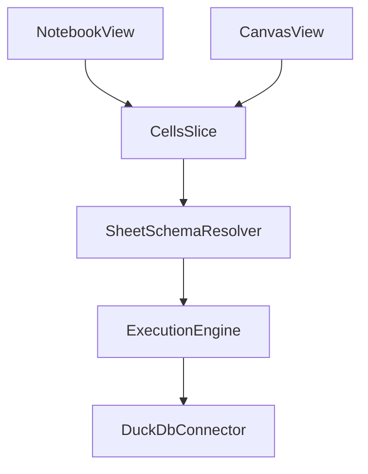

# Cells / Notebook / Canvas Architecture Review (Revised)

## Position

`Sheets` in `CellsSlice` is a meaningful concept and should stay.

- `cells.config.data` is the canonical cell dictionary.
- `cells.config.sheets` provides shared grouping, ordering scope, and dependency edges for those cells.
- notebook/canvas remain view adapters that add view-only metadata.

This keeps one model layer for cell execution/DAG while allowing multiple UI projections.

## Sheet-DB Coupling Guidance

Couple sheets to DB namespaces for execution, but do not hard-couple to global DB session state.

- Add a stable `schemaName` (or `schemaId`) on each sheet in `CellsSlice`.
- Treat sheet `title` as display-only, never as schema identity.
- Resolve schema at execution time from the sheet/call context.
- Avoid mutable global `SET schema` style flow, because async execution and cascades can race.
- Keep convenience behavior by supporting same-sheet implicit lookup in dependency/render logic, not global connector state.
- Keep dependency analysis and cascades sheet-local by default.
- Permit cross-sheet access only through explicit fully-qualified SQL references, without auto-creating cross-sheet DAG edges.
- Support implicit same-sheet SQL ergonomics by resolving unqualified names to the active sheet schema at execution/dependency-analysis time.

## Updated Issues and Recommendations

1. **Sheet ID mismatch bug** in `createDefaultCellsConfig` should be fixed immediately (`id: sheetId`).
2. `**removeSheet` semantics should match single-owner policy**: each cell belongs to exactly one sheet, so removing a sheet hard-deletes all its cells and related status/cache/edges.
3. **Type safety debt** remains high: introduce real discriminated unions + type guards and replace hot-path `as any` usage.
4. **DB accessor anti-pattern**: replace repeated `(get() as any).db?.sqlSelectToJson` with typed helper.
5. **Cascade trigger criteria** should be semantic: SQL text, inputs, and result identity changes; not title-only or view-only changes.
6. **Duplicate `initializeInput**` should be removed from notebook and imported from cells helper.
7. **Schema ownership duplication**: keep canonical cell schemas in cells; keep notebook/canvas view metadata schemas local.
8. **Canvas perf issue**: remove global `cellData` dependency from node type memoization and subscribe per-node.
9. **Sync dependency fallback** is imprecise; improve matching boundaries when AST path is unavailable.
10. **Packaging cleanup**: remove unused `@sqlrooms/vega` dependency.
11. **Dependency scope policy is not explicit**: dependencies/cascades should remain local to a sheet unless SQL uses explicit fully-qualified external references.
12. **Query ergonomics without global schema switching**: users should not need to type schema prefixes for same-sheet references.
13. **Entrypoint API surface is inconsistent** across `cells`/`notebook`/`canvas` (`index.ts` shape, type export style, namespace pattern, and package docs strategy).

## Execution Plan

### Phase 1: Correctness and Semantics

- Fix default sheet ID mismatch in `packages/cells/src/cellsSlice.ts`.
- Define and implement explicit single-owner policy (`cell` belongs to exactly one sheet) and hard-delete behavior for `removeSheet`.
- Add tests for:
  - `sheets[key].id === key`
  - adding/moving/removing cells preserves single-owner invariant
  - removing a sheet deletes all owned cells/status/edges/cache

### Phase 2: Typed Foundations

- In `packages/cells/src/types.ts`, add:
  - canonical `SqlCell | TextCell | VegaCell | InputCell` union for runtime usage
  - type guards (`isSqlCell`, `isTextCell`, `isVegaCell`, `isInputCell`)
- Apply guards to reduce `as any` in:
  - `packages/cells/src/cellsSlice.ts`
  - `packages/cells/src/execution.ts`
  - `packages/notebook/src/NotebookSlice.ts`
  - `packages/canvas/src/CanvasSlice.ts`

### Phase 3: Sheet Namespace Integration

- Extend `Sheet` type in `packages/cells/src/types.ts` with stable namespace field:
  - `schemaName` (human-readable stable) or `schemaId` (opaque stable)
- In `packages/cells/src/execution.ts`, resolve schema from sheet metadata, not title.
- Keep schema resolution explicit in function calls and execution context.
- Do not introduce mutable global connector schema state as source of truth.
- Document that default execution/dependency scope is sheet-local.
- Add implicit same-sheet name resolution:
  - unqualified identifiers resolve to current sheet schema
  - fully-qualified identifiers remain unchanged
  - SQL text used for execution and dependency analysis must use the same resolution rules

### Phase 4: Execution and Dependency Behavior

- Refine `updateCell` cascade criteria to semantic changes only.
- Harden execution error/cancel paths to avoid silent cascade failures.
- Improve sync fallback matching in `packages/cells/src/sqlHelpers.ts`.
- Ensure `getDownstream`, `runDownstreamCascade`, and edge derivation only consider cells in the active sheet.
- Do not auto-generate cross-sheet edges from SQL parsing.
- Add optional validation/warning when SQL references other schemas, but keep it explicit/manual.
- Add optional dev-time invariant check that each edge endpoint belongs to the same sheet.
- Add tests for SQL resolution behavior:
  - `FROM my_result` resolves to active sheet schema
  - `FROM other_schema.my_result` is preserved as-is
  - dependency detection matches rewritten execution semantics

### Phase 5: View and Performance Cleanup

- Deduplicate `initializeInput` in `packages/notebook/src/NotebookUtils.ts` to use `packages/cells/src/components/Input/helpers.ts`.
- Refactor `packages/canvas/src/Canvas.tsx`:
  - remove `cellData` from `nodeTypes` memo dependency
  - read cell data inside node-level components/selectors
- Optionally extract `ensureViewSheetMeta` helper in canvas/notebook slices.

### Phase 6: Schema Ownership and Package Hygiene

- Consolidate canonical cell schemas/types in cells package.
- Keep notebook/canvas view schemas local to those packages.
- Remove `@sqlrooms/vega` from `packages/canvas/package.json` if still unused.
- Run package-level checks (`typecheck`, tests, lint) for touched packages.
- Add tests proving no implicit cross-sheet cascades are triggered.

### Phase 7: Public API and Entrypoint Consistency

- Audit and normalize entrypoints:
  - `packages/cells/src/index.ts`
  - `packages/notebook/src/index.ts`
  - `packages/canvas/src/index.ts`
- Remove redundant imports/re-exports in `cells` entrypoint (including duplicate `SqlCellContent`/`SqlCellRunButton` patterns).
- Decide and codify one public API style:
  - namespace-object pattern used consistently, or
  - direct exports only (no ad-hoc namespace objects)
- Prefer explicit type exports for public API (`export type { ... }`) and reduce wildcard surface growth from `export *` where feasible.
- Add/align `@packageDocumentation` strategy (entrypoint JSDoc and/or README conventions) across all three packages.
- Document API tiers (`stable` vs `internal`) in package READMEs so import paths are predictable.
- Keep this phase non-behavioral: no runtime logic changes, only API surface cleanup and docs.

## Priority Summary

| Priority | Item                                           | Rationale                                                         |
| -------- | ---------------------------------------------- | ----------------------------------------------------------------- |
| High     | Sheet ID fix + single-owner removeSheet policy | Enforce deterministic ownership and predictable deletion behavior |
| High     | Typed guards + DB accessor helper              | Reduce runtime risk and improve maintainability                   |
| High     | Sheet schema namespace model                   | Correctness for multi-sheet execution without races               |
| Medium   | Semantic-only cascade triggers                 | Reduce unnecessary recomputation and side effects                 |
| Medium   | Sheet-local dependency enforcement             | Keep DAG deterministic and avoid cross-sheet coupling             |
| Medium   | Implicit same-sheet SQL name resolution        | Keep SQL ergonomic without relying on mutable global schema state |
| Medium   | Canvas memoization fix                         | Eliminate avoidable full node remounting                          |
| Low      | Entrypoint API consistency                     | Improve discoverability, reduce accidental API drift              |
| Low      | UI location of `SheetsTabBar`                  | Design decision, no correctness impact                            |

