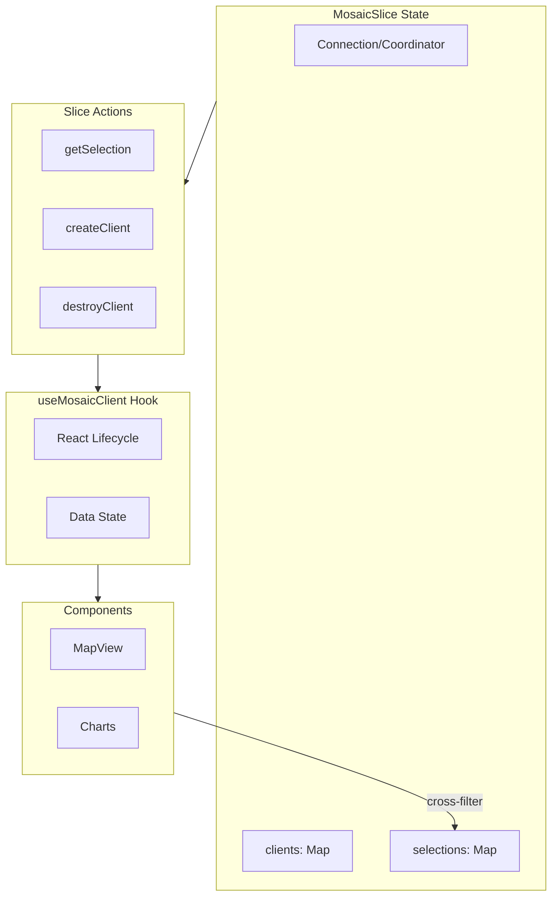

# Mosaic Client Abstraction

## Problem

Currently, Mosaic clients are created ad-hoc in components like [`MapView.tsx`](examples/deckgl-mosaic/src/components/map/MapView.tsx) with manual lifecycle management. Selections for cross-filtering (like `brush`) are defined in separate files with no central tracking.

## Proposed Architecture

A **combination approach**: slice functions for state management + a helper hook for React lifecycle.




## Implementation

### 1. Extend MosaicSlice with client/selection management

In [`packages/mosaic/src/MosaicSlice.ts`](packages/mosaic/src/MosaicSlice.ts):

- Add `clients: Map<string, TrackedClient>` to track all active clients
- Add `selections: Map<string, Selection>` to store named selections for cross-filtering
- Add `getSelection(name, type?)` - get or create a named selection
- Add `createClient(options)` - create a client and register it, returns client ID
- Add `destroyClient(id)` - disconnect and remove a client
- Add `destroyAllClients()` - cleanup helper for unmounting

### 2. Create useMosaicClient hook

New file: `packages/mosaic/src/useMosaicClient.ts`

```typescript
export function useMosaicClient<T>(options: {
  id?: string;
  selectionName?: string;  // Get/create a named selection
  selection?: Selection;   // Or use a direct selection
  query: (filter: unknown) => Query;
  enabled?: boolean;
}): {
  data: T | null;
  isLoading: boolean;
  client: MosaicClient | null;
}
```

The hook will:

- Call `createClient` when mosaic is ready
- Automatically call `destroyClient` on unmount
- Manage loading/data state internally
- Return the client reference for direct access (e.g., for `brush.update()`)

### 3. Refactor MapView to use the new abstraction

The current 40-line useEffect in [`MapView.tsx`](examples/deckgl-mosaic/src/components/map/MapView.tsx) lines 51-90 becomes:

```typescript
const {data, isLoading, client} = useMosaicClient({
  selectionName: 'brush',
  query: (filter) => Query.from('earthquakes')
    .select('Latitude', 'Longitude', 'Magnitude', 'Depth', 'DateTime')
    .where(filter),
});

const table = useMemo(() => 
  data ? buildGeoArrowPointTable(...) : null, 
[data]);
```


### 4. Refactor filterPlots.ts to use slice selections

Instead of exporting a module-level `brush`:

```typescript
// Before (filterPlots.ts)
export const brush = Selection.crossfilter();
```

Components will get the shared selection from the slice:

```typescript
// After (in components)
const brush = useRoomStore(s => s.mosaic.getSelection('brush'));
```

This ensures the selection is tracked centrally and can be accessed/cleared from anywhere.

## Files to Modify

| File | Changes ||------|---------|| [`packages/mosaic/src/MosaicSlice.ts`](packages/mosaic/src/MosaicSlice.ts) | Add clients/selections maps and management functions || `packages/mosaic/src/useMosaicClient.ts` | New file - React hook for client lifecycle || [`packages/mosaic/src/index.ts`](packages/mosaic/src/index.ts) | Export new hook and types || [`examples/deckgl-mosaic/src/components/map/MapView.tsx`](examples/deckgl-mosaic/src/components/map/MapView.tsx) | Refactor to use useMosaicClient || [`examples/deckgl-mosaic/src/components/filters/filterPlots.ts`](examples/deckgl-mosaic/src/components/filters/filterPlots.ts) | Remove module-level brush, use slice selection |

## Benefits

1. **Centralized tracking** - All clients visible in store for debugging/cleanup