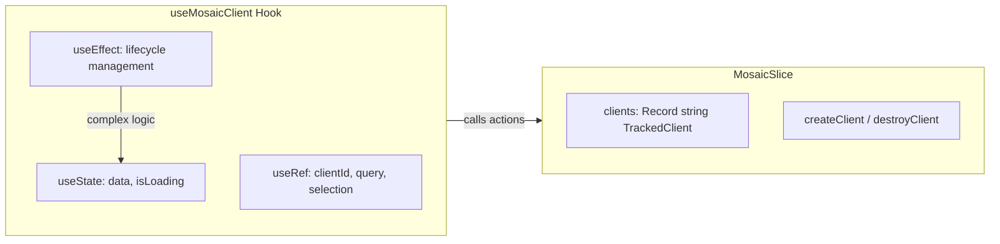
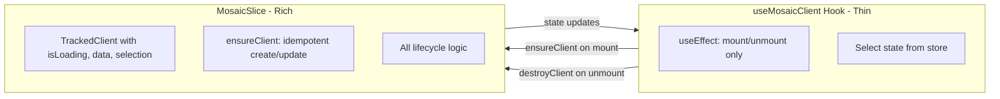

# Refactor useMosaicClient State Management

## Overview

Move client lifecycle management and per-client state from `useMosaicClient` hook into `MosaicSlice` to reduce useEffect complexity and centralize state management.

## Current Architecture



**Problems with current approach:**

- Complex useEffect with multiple refs for stability
- Selection change detection duplicated in hook
- Loading/data state local to component, not shareable
- Multiple hooks for same client would create duplicate clients

## Proposed Architecture




## Implementation

### 1. Extend TrackedClient type in [MosaicSlice.ts](packages/mosaic/src/MosaicSlice.ts)

Add per-client state tracking:

```typescript
export type TrackedClient<T = unknown> = {
  id: string;
  client: ReturnType<typeof makeClient>;
  createdAt: number;
  // NEW fields:
  isLoading: boolean;
  data: T | null;
  selection?: Selection;  // Track for change detection
  queryResultCallback?: (result: T) => void;  // External callback
};
```


### 2. Add ensureClient action to MosaicSlice

New action that handles idempotent client creation:

```typescript
ensureClient<T>(options: MosaicClientOptions<T> & { 
  id: string;  // Required for ensure pattern
  onQueryResult?: (result: T) => void;  // Optional external callback
}): void {
  // 1. Check if client exists with same id
  // 2. If exists and selection matches, no-op
  // 3. If exists but selection changed, destroy and recreate
  // 4. If not exists, create new client
  // 5. Wrap queryResult to update store state AND call external callback
}
```


### 3. Update createClient to set loading/data state

Modify `createClient` to:

- Initialize `isLoading: true`, `data: null`
- Wrap `queryResult` to update store state when results arrive

### 4. Simplify useMosaicClient hook

Reduce to a thin wrapper:

```typescript
export function useMosaicClient<T>(options: UseMosaicClientOptions<T>) {
  const stableId = useRef(options.id ?? createId()).current;
  const connectionStatus = useStoreWithMosaic(s => s.mosaic.connection.status);
  const ensureClient = useStoreWithMosaic(s => s.mosaic.ensureClient);
  const destroyClient = useStoreWithMosaic(s => s.mosaic.destroyClient);
  
  // Select per-client state from store
  const clientState = useStoreWithMosaic(s => s.mosaic.clients[stableId]);
  
  useEffect(() => {
    if (!options.enabled || connectionStatus !== 'ready') return;
    
    ensureClient({
      id: stableId,
      selectionName: options.selectionName,
      selection: options.selection,
      query: options.query,
      onQueryResult: options.queryResult,
    });
    
    return () => destroyClient(stableId);
  }, [options.enabled, connectionStatus, stableId, options.selectionName, options.selection]);
  
  return {
    data: clientState?.data as T | null,
    isLoading: clientState?.isLoading ?? true,
    client: clientState?.client ?? null,
  };
}
```


### 5. Files to modify

| File | Changes ||------|---------|| [MosaicSlice.ts](packages/mosaic/src/MosaicSlice.ts) | Extend TrackedClient, add ensureClient, update createClient || [useMosaicClient.ts](packages/mosaic/src/useMosaicClient.ts) | Simplify to thin wrapper || [index.ts](packages/mosaic/src/index.ts) | Export new types if needed |

## Benefits

1. **Testable**: Slice actions can be unit tested without React
2. **Shareable**: Multiple components using same client id share state
3. **Simpler hook**: No complex refs or effect logic
4. **Idempotent**: `ensureClient` is safe to call multiple times