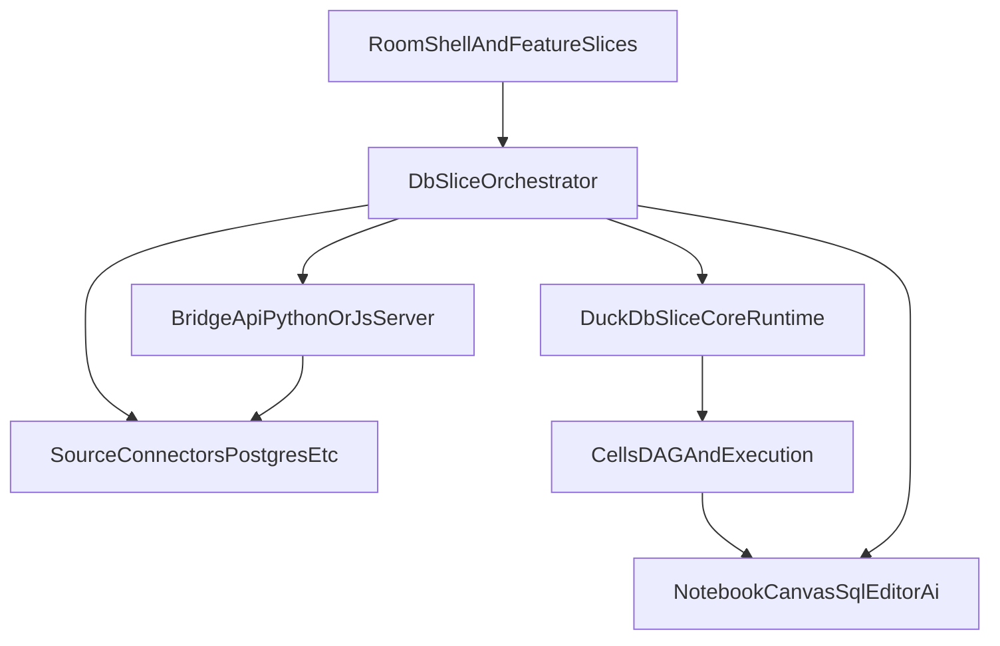

# Multi-Database Architecture Plan (DuckDB Core + DB Orchestration)

## Decision Summary

- Keep `[/Users/ilya/Workspace/sqlrooms/packages/duckdb/src/DuckDbSlice.ts](/Users/ilya/Workspace/sqlrooms/packages/duckdb/src/DuckDbSlice.ts)` as a first-class core slice.
- Add a new package (recommended: `@sqlrooms/db`) for multi-connector orchestration.
- Treat DuckDB as canonical runtime for DAG/dependency logic and cross-source joins.
- For non-DuckDB connectors, query remotely and materialize results into DuckDB.
- Reuse most of the current `DuckDbConnector` API surface as the base connector contract to minimize migration churn.
- Use one core materialization policy owned by DuckDB orchestration with strict ephemeral attached DB as default.

## Why This Split

- `DuckDbSlice` already owns DuckDB-specific capabilities (AST parse, schema cache, table/view helpers) that should remain specialized.
- Multi-database concerns (connection registry, routing, source sync) are cross-cutting and should not bloat DuckDB internals.
- Keeps cells/notebook/canvas/sql-editor aligned on one dependency/runtime model.
- Preserving `QueryHandle` semantics (`result`, `cancel`, `signal`) across all connectors keeps cancellation/composability behavior consistent.

## Target Architecture

## Scope (Milestone 1)

- Introduce multi-connector orchestration primitives.
- Add connector selection metadata for SQL cells.
- Preserve existing DAG semantics (DuckDB/materialized outputs only).
- No native cross-engine dependency inference yet.
- Include runtime awareness (`browser` vs `server`) in connector registration/routing.
- Define one language-agnostic bridge contract that can be implemented in Python (`sqlrooms-server`) or JS backends.
- Materialization strategy is core-only (not per source connector), with strict ephemeral attached DB as the default in all runtimes.

## Phase 1: New `@sqlrooms/db` Package Skeleton

1. Create package structure:
  - `[/Users/ilya/Workspace/sqlrooms/packages/db/src/index.ts](/Users/ilya/Workspace/sqlrooms/packages/db/src/index.ts)`
  - `[/Users/ilya/Workspace/sqlrooms/packages/db/src/DbSlice.ts](/Users/ilya/Workspace/sqlrooms/packages/db/src/DbSlice.ts)`
  - `[/Users/ilya/Workspace/sqlrooms/packages/db/src/types.ts](/Users/ilya/Workspace/sqlrooms/packages/db/src/types.ts)`
2. Define orchestration types:
  - `DbConnection`, `DbEngineId`, `QueryExecutionRequest`, `MaterializationResult`
3. Add read-only/registration actions (no behavior migration yet):
  - `listConnections`, `registerConnection`, `removeConnection`, `testConnection`

## Phase 2: Connector Adapter Contract + DuckDB Adapter

1. Define base connector contract under `@sqlrooms/db` by reusing most of `[/Users/ilya/Workspace/sqlrooms/packages/duckdb-core/src/DuckDbConnector.ts](/Users/ilya/Workspace/sqlrooms/packages/duckdb-core/src/DuckDbConnector.ts)`:
  - `initialize`, `destroy`, `execute`, `query`, `queryJson`
  - existing `QueryHandle` behavior
2. Extract DuckDB-specific methods into capability extensions (or keep them optional):
  - `loadFile`, `loadArrow`, `loadObjects`
  - AST parse capability (`sqlSelectToJson`) remains core-DuckDB feature
3. Add DuckDB adapter wrapper around `[/Users/ilya/Workspace/sqlrooms/packages/duckdb/src/DuckDbSlice.ts](/Users/ilya/Workspace/sqlrooms/packages/duckdb/src/DuckDbSlice.ts)` primitives.
4. Keep `DuckDbSlice` API stable and unchanged for current callers.

## Phase 3: Runtime Awareness + Bridge Contract (Python and JS)

1. Add runtime metadata to connector registrations:
  - `runtimeSupport: 'browser' | 'server' | 'both'`
  - optional `requiresBridge: boolean`
2. Define bridge API contract independent of implementation language:
  - `listConnections`, `testConnection`, `listCatalog`, `executeQuery`, `fetchArrow`, `cancelQuery`
3. Ensure contract is implementable by:
  - Python `sqlrooms-server`
  - JS/TS Node server
4. Route unsupported browser connectors through bridge automatically.

## Phase 4: Orchestrated Query Routing + Materialization

1. Add `runQuery` to `DbSlice`:
  - if target connector is DuckDB, execute directly via core.
  - if external connector and supported in current runtime, execute directly.
  - if external connector is backend-only, call bridge API.
  - materialize external results into DuckDB table/view.
2. Return normalized execution metadata (`resultRelation`, `engineId`, `materialized`).
3. Store provenance for materialized outputs (connection + source + timestamp).
4. Add core materialization config under orchestration/runtime settings:
  - `coreMaterialization.strategy: 'schema' | 'attached_ephemeral'`
  - default `strategy: 'attached_ephemeral'` for both browser and server
  - strict ephemeral semantics: materialized external data is session-scoped and not persisted across restarts
  - no per-connector override in milestone 1.

## Phase 5: Cell Connector Selection Integration

1. Extend SQL cell metadata in `[/Users/ilya/Workspace/sqlrooms/packages/cells/src/types.ts](/Users/ilya/Workspace/sqlrooms/packages/cells/src/types.ts)`:
  - `connectorId` (default core DuckDB)
2. Update SQL cell UI in `[/Users/ilya/Workspace/sqlrooms/packages/cells/src/components/SqlCellContent.tsx](/Users/ilya/Workspace/sqlrooms/packages/cells/src/components/SqlCellContent.tsx)`:
  - add connector dropdown selector
3. Update execution path in `[/Users/ilya/Workspace/sqlrooms/packages/cells/src/execution.ts](/Users/ilya/Workspace/sqlrooms/packages/cells/src/execution.ts)` to use orchestrator route.

## Phase 6: Keep DAG and Canvas/Notebook Semantics Stable

1. Keep dependency graph semantics unchanged in:
  - `[/Users/ilya/Workspace/sqlrooms/packages/cells/src/dagUtils.ts](/Users/ilya/Workspace/sqlrooms/packages/cells/src/dagUtils.ts)`
  - `[/Users/ilya/Workspace/sqlrooms/packages/cells/src/sqlHelpers.ts](/Users/ilya/Workspace/sqlrooms/packages/cells/src/sqlHelpers.ts)`
2. Rule: only DuckDB-visible outputs (native or materialized) participate in dependencies and cascades.
3. No cross-connector edge inference in this milestone.

## Phase 7: Framework-Wide Adoption

1. Migrate SQL editor query execution to orchestration API:
  - `[/Users/ilya/Workspace/sqlrooms/packages/sql-editor/src/SqlEditorSlice.tsx](/Users/ilya/Workspace/sqlrooms/packages/sql-editor/src/SqlEditorSlice.tsx)`
2. Migrate room-shell SQL data source execution path:
  - `[/Users/ilya/Workspace/sqlrooms/packages/room-shell/src/RoomShellSlice.ts](/Users/ilya/Workspace/sqlrooms/packages/room-shell/src/RoomShellSlice.ts)`
3. Ensure notebook/canvas need no special-case logic beyond cells execution updates.
4. Add backend validation path by updating SQLRooms CLI to exercise a backend connector:
  - add a Postgres connector flow in `sqlrooms-cli` usage/examples
  - run remote query via bridge and materialize into core DuckDB
  - verify downstream querying from DuckDB using materialized result.

## Phase 8: CLI Postgres Scenario (Concrete E2E Path)

1. Extend CLI/server runtime config exposure for connector bridge testing:
  - `[/Users/ilya/Workspace/sqlrooms/python/sqlrooms-cli/sqlrooms/cli.py](/Users/ilya/Workspace/sqlrooms/python/sqlrooms-cli/sqlrooms/cli.py)` to accept optional Postgres test connection inputs (direct flags or env-backed defaults for local testing).
  - `[/Users/ilya/Workspace/sqlrooms/python/sqlrooms-cli/README.md](/Users/ilya/Workspace/sqlrooms/python/sqlrooms-cli/README.md)` with a reproducible Postgres walkthrough.
2. Add bridge-compatible backend endpoint flow in SQLRooms server stack:
  - `[/Users/ilya/Workspace/sqlrooms/python/sqlrooms-server/sqlrooms/server/server.py](/Users/ilya/Workspace/sqlrooms/python/sqlrooms-server/sqlrooms/server/server.py)`
  - `[/Users/ilya/Workspace/sqlrooms/python/sqlrooms-server/sqlrooms/server/query.py](/Users/ilya/Workspace/sqlrooms/python/sqlrooms-server/sqlrooms/server/query.py)`
  - keep existing WS query protocol intact; add connector-routed execution as additive behavior.
3. Ensure E2E scenario validates this sequence:
  - run a Postgres query through backend connector path
  - return Arrow payload to core runtime
  - materialize into DuckDB using core `schema` strategy
  - run a follow-up DuckDB query against materialized relation successfully.
4. Keep this scenario as first integration target before adding additional source connectors.

## Phase 9: Connector Isolation via Subpath Exports

1. Expose connector modules with isolated entrypoints:
  - `@sqlrooms/db/connectors/duckdb`
  - `@sqlrooms/db/connectors/postgres` (first external, runtime-aware)
  - `@sqlrooms/db/bridge` (shared bridge client + schemas)
2. Keep connector-specific deps out of core `@sqlrooms/db` entrypoint where possible.

## Phase 10: Validation and Rollout Safety

1. Add tests:
  - connector registry lifecycle
  - runtime routing decisions (`browser` direct vs bridge)
  - bridge contract conformance (shared test vectors for Python/JS impls)
  - external query materialization into DuckDB
  - cell connector selection behavior
  - DAG regression with mixed connector cells
  - end-to-end backend connector check through SQLRooms CLI + Postgres
2. Run validation:
  - `pnpm --filter @sqlrooms/db typecheck`
  - `pnpm --filter @sqlrooms/duckdb typecheck`
  - `pnpm --filter @sqlrooms/cells typecheck`
  - targeted tests for `db`, `cells`, `sql-editor`, `room-shell`
  - backend integration verification with updated `sqlrooms-cli` example path.

## CLI Postgres Acceptance Criteria

- A documented command path exists in `sqlrooms-cli` README to run with a Postgres test connection.
- Backend connector execution returns Arrow-compatible results without breaking existing WS message types.
- Non-DuckDB result is materialized into a strict ephemeral attached DuckDB database by default.
- A subsequent DuckDB query in the same session can read the materialized relation.
- Materialized external data is not persisted across process restarts.
- Existing DuckDB-only CLI usage remains unchanged.

## Non-Goals (Milestone 1)

- Native cross-source join pushdown without materialization.
- Cross-connector dependency graph inference.
- Replacing/removing `DuckDbSlice`.

## Follow-up Milestones

- Incremental refresh/sync policies for external sources.
- Pushdown planner for partial remote execution.
- Additional connector packages (MySQL, BigQuery, etc.)
- Optional direct browser-native connectors where security/auth model permits.

