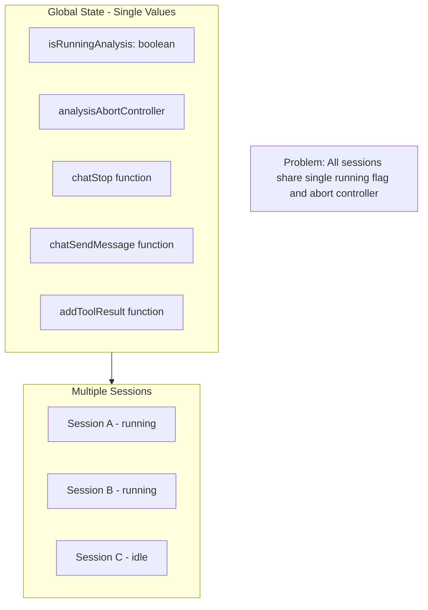

# Parallel Chat Sessions Support

Your analysis is correct. Here's the complete picture of what needs to change:

## Critical Bug: Messages Written to Wrong Session

**Symptom:** Start a chat in Session A, switch to Session B while streaming, and Session A's messages get appended to Session B.**Root Cause:** All chat callbacks (`onChatFinish`, `onChatData`, `onChatError`, `onChatToolCall`) read `currentSessionId` at execution time:

```typescript
// chatTransport.ts line 425 - PROBLEM: reads current session, not originating session
const currentSessionId = store.getState().ai.config.currentSessionId;
```

When user switches sessions during streaming, `currentSessionId` changes, so the finishing stream writes to the wrong session.**Fix:** Capture `sessionId` when transport is created and close over it in all callbacks. This is covered in Section 2 below.---

## Current Architecture Problems




## Required Changes by Category

### 1. State Model Changes in [AiSlice.ts](packages/ai-core/src/AiSlice.ts)

**Move these from global to per-session:**| Current Global State | Should Be ||---------------------|-----------|| `isRunningAnalysis: boolean` | `runningSessionIds: Set<string>` or per-session field || `analysisAbortController?: AbortController` | `sessionAbortControllers: Map<string, AbortController>` || `chatStop?: () => void` | `sessionChatStops: Map<string, () => void>` || `chatSendMessage?: (...)` | `sessionChatSendMessages: Map<string, (...)>` || `addToolResult?: AddToolResult` | `sessionAddToolResults: Map<string, AddToolResult>` || `pendingToolCallResolvers` (line 203) | Already keyed by toolCallId, but should also track sessionId for cleanup |**New helper methods needed:**

```typescript
isSessionRunning: (sessionId: string) => boolean;
cancelSession: (sessionId: string) => void;  // Cancel specific session
getSessionAbortSignal: (sessionId: string) => AbortSignal | undefined;
```


### 2. Chat Transport Changes in [chatTransport.ts](packages/ai-core/src/chatTransport.ts)

**This fixes the "messages to wrong session" bug.**The callbacks are created in `createChatHandlers` (line 298) and the transport factory (line 170). They must capture `sessionId` at creation time, not read `currentSessionId` at execution time.**Changes needed:**

1. **`createChatHandlers`** - Accept `sessionId` parameter and use it instead of `store.getState().ai.config.currentSessionId`:

- `onChatToolCall` (lines 317, 344, 364): Use captured sessionId for abort signal lookup
- `onChatFinish` (line 425): Use captured sessionId for message storage
- `onChatData` (line 411): Use captured sessionId for tool data storage  
- `onChatError` (line 605): Use captured sessionId for error storage

2. **`createLocalChatTransportFactory`** - Capture sessionId when transport is created:

- Line 237: Use session-specific abort signal from captured sessionId

3. **Update `useAiChat`** - Pass captured sessionId when creating transport and handlers:
   ```typescript
               // Capture sessionId at hook initialization
               const capturedSessionId = sessionId;
               
               // Pass to transport factory and handlers
               const transport = useMemo(() => {
                 return getLocalChatTransport(capturedSessionId);
               }, [capturedSessionId, ...]);
   ```


**Key pattern:** Every callback closure must capture the sessionId that was current when the chat started, not look it up dynamically.

### 3. useAiChat Hook Changes in [useAiChat.ts](packages/ai-core/src/hooks/useAiChat.ts)

The hook currently registers functions globally:

```153:168:packages/ai-core/src/hooks/useAiChat.ts
  // Register stop with the store so cancelAnalysis can stop the stream
  useEffect(() => {
    setChatStop?.(stop);
    return () => setChatStop?.(undefined);
  }, [setChatStop, stop]);

  // Register sendMessage with the store so it can be accessed from the slice
  useEffect(() => {
    setChatSendMessage?.(sendMessage);
    return () => setChatSendMessage?.(undefined);
  }, [setChatSendMessage, sendMessage]);

  // Register addToolResult with the store so it can be accessed from the slice
  useEffect(() => {
    setAddToolResult?.(addToolResult);
    return () => setAddToolResult?.(undefined);
  }, [setAddToolResult, addToolResult]);
```

**Change to:** Register with sessionId as key:

```typescript
setChatStop?.(sessionId, stop);
setChatSendMessage?.(sessionId, sendMessage);
setAddToolResult?.(sessionId, addToolResult);
```

**Abort signal check** (lines 80-87): Should check session-specific abort:

```typescript
const isAborted = useStoreWithAi(
  (s) => s.ai.getSessionAbortSignal(sessionId)?.aborted ?? false,
);
```


### 4. UI Component Changes

#### [QueryControls.tsx](packages/ai-core/src/components/QueryControls.tsx)

```typescript
// Line 28-30: Change from global to session-specific
const isRunningAnalysis = useStoreWithAi((s) => 
  s.ai.isSessionRunning(s.ai.config.currentSessionId ?? '')
);
const cancelAnalysis = useStoreWithAi((s) => s.ai.cancelSession);
// Then call: cancelAnalysis(currentSession.id)
```


#### [AnalysisResultsContainer.tsx](packages/ai-core/src/components/AnalysisResultsContainer.tsx)

```typescript
// Line 24: Change from global to session-specific
const currentSessionId = useStoreWithAi((s) => s.ai.config.currentSessionId);
const isRunningAnalysis = useStoreWithAi((s) => 
  s.ai.isSessionRunning(currentSessionId ?? '')
);
```


### 5. Edge Cases to Handle

1. **Session switching while running:** The old session continues running. UI should indicate which sessions are running (e.g., badge/indicator on session tabs).
2. **Cleanup on session deletion:** If a running session is deleted, cancel it first.
3. **Cancel current vs cancel specific:** Keep `cancelAnalysis()` for "cancel current" convenience, add `cancelSession(sessionId)` for explicit control.
4. **Function registration lifecycle:** When session switches, the old 

instance's functions should remain registered for that sessionId until explicitly cleared.

### 6. Optional: Per-Session Draft Prompt

Currently `analysisPrompt` is global. You may want per-session drafts:

```typescript
// Option A: Store in session schema
session.draftPrompt?: string;

// Option B: Separate map
sessionDraftPrompts: Map<string, string>;
```

This is lower priority since users typically work on one prompt at a time.

## Implementation Order

1. Add per-session state maps to `AiSliceState`