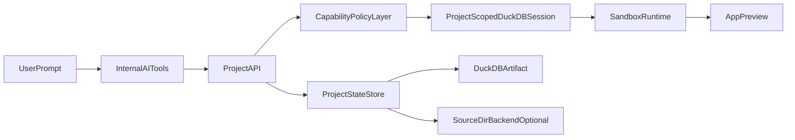

# SQLRooms CLI App-Builder Plan (Adjusted)

## Product Positioning

Build SQLRooms as an **AI-assisted analytics app builder** with a reproducible project artifact, but avoid overreach in v1.

- Primary value: fast app generation + one portable project artifact.
- Secondary value: external agent interoperability (MCP) and advanced runtime options.

## Strategic Decision

Use a **single project model** with **pluggable storage/runtime adapters**.

- `artifact` mode: project state + app files in DuckDB metadata tables.
- `source` mode (later): project state mirrored to directory for git-native workflows.
- MVP ships only `artifact` mode, but internal abstractions should not hard-code DuckDB-only assumptions.

## Architecture (Target)

## MVP Cut (Brutal)

### In Scope

- CLI lifecycle:
  - `sqlrooms new <project.duckdb>`
  - `sqlrooms open <project.duckdb>`
- One app per project.
- Persist only:
  - data references/imported tables
  - layout/panel state
  - generated app file tree (`filesTree`) as text
- AI tools only:
  - `files.list`, `files.read`, `files.write`
  - optional `query.sql` (SELECT-only default)
- Export:
  - `sqlrooms export --dir ./out`

## App Creation UX

Keep `New Notebook` and `New Canvas`, and add `New App` as a first-class peer in the same create menu.

- On `New App` click, show a creation dialog with:
  - prompt input (what app to build)
  - template selector (Mosaic-first templates + fallback template)
  - app name field (autogenerated by default; used as tab name, user editable)
- On submit, create the app artifact, open it in a new tab, and start generation immediately from prompt + template.
- Keep chat attached to the app tab for iterative user-directed refinements after initial generation.

## Template Strategy (App/Dashboard)

Use a **Mosaic-first but not Mosaic-only** approach.

- Default dashboard templates should target `@sqlrooms/mosaic` to deliver interactive cross-filtering as a core differentiator.
- Keep at least one broad fallback template (table + simple chart) that does not depend on deep VGPlot/Mosaic composition.
- Treat AI generation as **scaffold-first**:
  - generate from a small set of tested Mosaic template blueprints
  - fill constrained placeholders (measures, dimensions, filters, layout)
  - avoid unconstrained free-form VGPlot code generation in MVP
- Support **bounded agentic auto-fix** when generated code fails validation:
  - run validators (VGPlot schema validation, build/type checks, runtime smoke checks)
  - retry automatically with error context for a limited number of attempts
  - if still failing, fallback to regenerate from selected template and surface a clear failure report in chat
- Defer open-ended multi-framework template expansion until telemetry shows consistent generation quality.

## Agent Tooling Strategy (WebContainer)

Use a **hybrid tooling model** because WebContainer command availability can vary by runtime/version.

- Default to structured app/notebook/data tools for deterministic edits and strong auditability.
- Provide an optional constrained shell tool for higher-leverage diagnostics and bulk edits when supported.
- Run startup capability probing (`<command> --version`/sanity checks) and build a per-session command capability map.
- Do not assume full Unix parity; treat `node` + package-manager workflows as baseline and gate other utilities by probe results.
- Require validator gates (schema/build/runtime) after shell-driven edits before accepting changes.

The reusable `@sqlrooms/webcontainer` package is now the execution backbone for app-builder runtime behavior.

- Implement shell capability probing and command routing in `@sqlrooms/webcontainer` once, then reuse it across CLI UI and MCP.
- Add a stable command API (for example: `runCommand`, `probeCapabilities`) with structured results (`exitCode`, `stdout`, `stderr`, timing).
- Keep structured tools as the default orchestration path; shell remains optional and policy-gated.

### Explicitly Out of Scope (Now)

- Multi-user collaborative editing for app code
- Arbitrary shell/package installs from AI tools
- Broad MCP tool surface and remote deploy pipeline
- Full branching/merge UX
- Complex binary asset pipeline
- Large open-ended template catalog across many charting frameworks

## Data Access Policy (Important)

Allow built apps to use **same project data** but through a **project-scoped, policy-enforced interface**.

- Use separate session/connection context for app queries.
- Default app capability: **SELECT-only SQL** on allowed schemas/views.
- Parse and allow only `SELECT` statements (including `WITH ... SELECT`), which aligns with current DuckDB SQL parsing support.
- Reject all non-SELECT operations by default (instead of blacklist-based filtering).
- Allow access to all user data schemas/tables by default, but explicitly deny reads from internal `__sqlrooms` schema.
- Enforce limits: timeout, memory/row limits, query audit log.
- Add explicit opt-in capability flags for writes.

## Workspace Artifact Model

Organize the project around stable typed artifacts instead of UI tabs.

- Hierarchy: `project` -> `artifact` -> (`notebook`, `app`, later `canvas`).
- MCP and internal APIs should target `artifact_id` (stable), not tab title/index (ephemeral).
- Tabs become a session/view concern that references an underlying `artifact_id`.
- This allows multiple app tabs and notebook tabs without API ambiguity.

## State Strategy (Unified)

Keep one primary persistence strategy for now and defer formal snapshots.

- Near term: persist current working state via `ui_state` (and CRDT room state where enabled).
- Do not introduce a second, parallel snapshot persistence model in MVP.
- Design app-builder artifact state so it can later map to CRDT checkpoints cleanly.
- Later phase: add user-facing named snapshots as CRDT-compatible checkpoints.

## MCP Strategy

Treat MCP as **phase 2 adapter**, not MVP foundation.

### Artifact-Oriented MCP Surface (Phase 2)

- `project.`*: `info` (singleton current project; no `open`/`switch` in this server mode)
- `artifact.`*: `list`, `create`, `get`, `rename`, `delete`
- `notebook.`*: `read`, `updateCells`, `runCell`, `export`
- `app.`*: `readFiles`, `writeFiles`, `generate`, `validate`, `preview`
- optional `app.shell`: constrained command execution gated by capability map and policy
- `data.*`: `query` (SELECT-only default, deny `__sqlrooms`)
- optional `session.*`: `listTabs`, `openArtifactTab`, `focusTab` (UI/session helpers only)
- Future: add `project.snapshot*` when CRDT-compatible checkpoint semantics are introduced.

### Safety Controls

- tool allowlist
- path jail
- operation quotas
- destructive action confirmation gates
- full mutation audit trail
- artifact-scoped permissions so notebook/app operations stay isolated by `artifact_id`
- shell command allowlist + timeout/stdio limits + capability-probe gating

## Sandbox Runtime Strategy

- MVP runtime: standardize on `@sqlrooms/webcontainer` as the primary sandbox runtime package (lowest delivery risk).
- Add `SandboxRuntime` abstraction now so alternatives can be introduced later:
  - BrowserPod (portal/sharing-centric)
  - Nodebox (fast browser-node demos)
- Keep runtime swap behind adapter; business logic should remain runtime-agnostic.

## Implementation Focus Areas

- [packages/webcontainer/src/WebContainerSlice.ts](/Users/ilya/Workspace/sqlrooms.4/packages/webcontainer/src/WebContainerSlice.ts)
- [packages/webcontainer/src/index.ts](/Users/ilya/Workspace/sqlrooms.4/packages/webcontainer/src/index.ts)
- [packages/webcontainer/package.json](/Users/ilya/Workspace/sqlrooms.4/packages/webcontainer/package.json)
- [python/sqlrooms-server/sqlrooms/server/db_async.py](/Users/ilya/Workspace/sqlrooms.4/python/sqlrooms-server/sqlrooms/server/db_async.py)
- [python/sqlrooms-cli/sqlrooms/web/launcher.py](/Users/ilya/Workspace/sqlrooms.4/python/sqlrooms-cli/sqlrooms/web/launcher.py)
- [python/sqlrooms-cli/sqlrooms/cli.py](/Users/ilya/Workspace/sqlrooms.4/python/sqlrooms-cli/sqlrooms/cli.py)
- [apps/sqlrooms-cli-ui/src/serverApi.ts](/Users/ilya/Workspace/sqlrooms.4/apps/sqlrooms-cli-ui/src/serverApi.ts)

## Milestones and Gates

### Milestone 1: Artifact MVP

- Project create/open works.
- File tree + app state persist/reload reliably.
- Export produces runnable source directory.
- Cross-machine reopen reproduces app behavior.
- Mosaic-first template scaffolds generate working apps for common BI prompts.
- `New App` flow ships with prompt input, template selection, and autogenerated tab name.

### Milestone 2: Determinism + Safety

- SELECT-only query policy, allowlists, limits, and audit logs active.
- Capability flags for write operations added.
- Generation reliability checks for Mosaic templates (schema/build/runtime validators + bounded auto-fix loop) are active.
- Agent capability probing and hybrid tool routing (structured-first, constrained-shell optional) are active via `@sqlrooms/webcontainer`.
- `@sqlrooms/webcontainer` exposes stable command execution/capability APIs and runtime status events for validator/auto-fix orchestration.

### Milestone 3: MCP Adapter

- Artifact-oriented MCP tools for `project`, `artifact`, `notebook`, `app`, and `data` are available and policy-governed.
- `project.*` is singleton-context only (`info`) for a single `sqlrooms-server` project instance.
- External assistant can safely operate on notebooks and multiple apps via `artifact_id` targeting.
- Optional `session.*` helpers can map artifacts to tabs without coupling core APIs to UI tab state.
- Snapshot tools remain deferred until CRDT-compatible checkpoint design is implemented.

## Success Criteria

- New user reaches working analytics app in <10 minutes.
- Same `.duckdb` artifact restores app + data context reliably.
- Exported source runs without manual surgery.
- AI/MCP operations remain inside sandbox boundaries.

