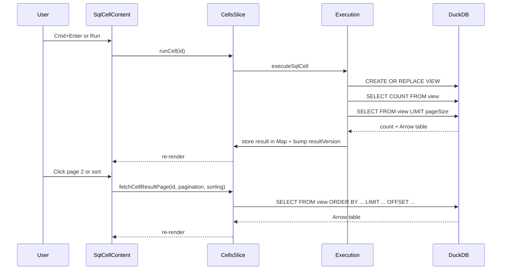

# Store SQL Cell Results Directly in Cells Slice

## Problem

`SqlCellContent` uses `QueryDataTable` which internally uses `useSql` to fetch results. This reactive hook approach is fundamentally incompatible with the imperative cell execution lifecycle, causing stale results on Cmd+Enter due to effect timing, cache-busting failures, and cascade interference.

## Approach

Bypass `useSql` entirely. After `executeSqlCell` creates the VIEW, imperatively fetch the first page + count via `connector.query()`, store the result in a module-level `Map` (outside Immer), and render directly using `useArrowDataTable` + `DataTablePaginated`. Pagination/sorting triggers a `fetchCellResultPage` action that queries the VIEW with new `LIMIT`/`OFFSET`/`ORDER BY`.

## Data flow




## Changes

### 1. Result cache infrastructure in `[packages/cells/src/cellsSlice.ts](packages/cells/src/cellsSlice.ts)`

Add a module-level Map outside Immer for storing Arrow results:

```typescript
import type * as arrow from 'apache-arrow';

type CellResultData = {
  arrowTable: arrow.Table;
  totalRows: number;
};

const cellResultCache = new Map<string, CellResultData>();
```

Add to `CellsSliceState` (in `[packages/cells/src/types.ts](packages/cells/src/types.ts)`):

```typescript
// New fields on cells:
resultVersion: Record<string, number>;  // triggers re-renders when bumped
setCellResult: (id: string, data: CellResultData) => void;
getCellResult: (id: string) => CellResultData | undefined;
clearCellResult: (id: string) => void;
fetchCellResultPage: (
  id: string,
  pagination: { pageIndex: number; pageSize: number },
  sorting?: { column: string; desc: boolean }[],
) => Promise<void>;
```

`setCellResult` writes to the Map and increments `resultVersion[id]` in Immer state (the version bump triggers React re-renders). `getCellResult` reads from the Map. `clearCellResult` wired into `removeCell` for cleanup.

`fetchCellResultPage` reads the view name from `cells.status[id].resultView`, builds a `LIMIT`/`OFFSET`/`ORDER BY` query using `makePagedQuery` from `@sqlrooms/data-table`, executes it via `connector.query()`, and stores the result via `setCellResult`. This is called by the UI on pagination/sorting changes.

### 2. Add `resultVersion` to `SqlCellStatus` in `[packages/cells/src/types.ts](packages/cells/src/types.ts)`

```typescript
export const SqlCellStatus = z.object({
  // ... existing fields ...
  resultVersion: z.number().default(0),  // NEW
});
```

### 3. Fetch first page in `[packages/cells/src/execution.ts](packages/cells/src/execution.ts)`

After the `CREATE OR REPLACE VIEW` succeeds (line ~84), fetch count + first page:

```typescript
// After VIEW creation succeeds:
const DEFAULT_PAGE_SIZE = 10;

const countHandle = await connector.query(
  `SELECT COUNT(*)::int AS count FROM ${tableName}`
);
const countRow = countHandle.toArray()[0];
const totalRows = countRow?.count ?? 0;

const pageHandle = await connector.query(
  `SELECT * FROM ${tableName} LIMIT ${DEFAULT_PAGE_SIZE}`
);

// Store result (via a callback or by accessing the setCellResult action)
```

The `executeSqlCell` function needs a way to call `setCellResult`. The simplest approach: add a `setCellResult` callback to `ExecuteSqlCellOptions`, passed from the registry's `runCell`.

### 4. Update registry `runCell` in `[packages/cells/src/defaultCellRegistry.tsx](packages/cells/src/defaultCellRegistry.tsx)`

Pass `setCellResult` to `executeSqlCell`:

```typescript
runCell: async ({id, opts, get, set}) => {
  const controller = new AbortController();
  // ...
  await executeSqlCell(id, get, set, {
    schemaName: opts?.schemaName || 'main',
    cascade: opts?.cascade,
    signal: controller.signal,
    setCellResult: get().cells.setCellResult,  // NEW
  });
  // ...
},
```

### 5. Replace QueryDataTable in `[packages/cells/src/components/SqlCellContent.tsx](packages/cells/src/components/SqlCellContent.tsx)`

Replace `QueryDataTable` with `useArrowDataTable` + `DataTablePaginated`:

```typescript
import {DataTablePaginated, useArrowDataTable, makePagedQuery} from '@sqlrooms/data-table';

// In component:
const resultVersion = useCellsStore(
  (s) => s.cells.resultVersion?.[id] ?? 0
);
const cellResult = useCellsStore((s) => s.cells.getCellResult(id));
const fetchPage = useCellsStore((s) => s.cells.fetchCellResultPage);
const arrowTableData = useArrowDataTable(cellResult?.arrowTable);

// Pagination/sorting state managed locally:
const [sorting, setSorting] = useState([]);
const [pagination, setPagination] = useState({ pageIndex: 0, pageSize: 10 });

// Fetch new page on pagination/sorting change:
useEffect(() => {
  if (resultName) fetchPage(id, pagination, sorting);
}, [pagination, sorting]);
// NOTE: do NOT include resultVersion in deps — initial page is
// fetched by executeSqlCell, not by this effect.

// Render:
<DataTablePaginated
  data={arrowTableData?.data}
  columns={arrowTableData?.columns}
  numRows={cellResult?.totalRows}
  pagination={pagination}
  onPaginationChange={setPagination}
  sorting={sorting}
  onSortingChange={setSorting}
  isFetching={status?.state === 'running'}
/>
```

The `resultVersion` selector ensures the component re-renders when new results arrive. `getCellResult` reads from the module-level Map. No `useSql` anywhere.

### 6. Remove `useRoomStoreApi` hack from Cmd+Enter handler

The `storeApi.setState(produce(...))` hack for flushing SQL is still needed (Monaco's onChange may lag), but all the `useSql`/cache-busting machinery is gone. The Cmd+Enter handler becomes simply: flush SQL to store + call `runCell`.

### 7. Also fix: `updateCell` cascade on every keystroke

The `updateCell` cascade fix from the previous change (default `cascade: false`, only InputCellContent passes `cascade: true`) also needs to be verified/kept. This is independent of the result display fix but was also broken.

## Files changed

- `[packages/cells/src/types.ts](packages/cells/src/types.ts)` — add `resultVersion` to `SqlCellStatus`, add `setCellResult`/`getCellResult`/`clearCellResult`/`fetchCellResultPage` to `CellsSliceState`
- `[packages/cells/src/cellsSlice.ts](packages/cells/src/cellsSlice.ts)` — add module-level `cellResultCache` Map, implement new actions, wire cleanup into `removeCell`
- `[packages/cells/src/execution.ts](packages/cells/src/execution.ts)` — fetch count + first page after VIEW creation, store via `setCellResult`
- `[packages/cells/src/defaultCellRegistry.tsx](packages/cells/src/defaultCellRegistry.tsx)` — pass `setCellResult` to `executeSqlCell`
- `[packages/cells/src/components/SqlCellContent.tsx](packages/cells/src/components/SqlCellContent.tsx)` — replace `QueryDataTable` with `DataTablePaginated` + `useArrowDataTable`, add pagination/sorting state, call `fetchCellResultPage` on page/sort changes

## What stays the same

- DuckDB VIEW is still created (other cells can reference it)
- `resultName`/`resultView` in status remain (used for view management, renaming, cascading)
- `cellRegistry` pattern and `runCell` signature unchanged
- `QueryDataTable` component untouched (still useful elsewhere)
- `useSql` hook untouched (still useful for non-cell use cases)
- `executeSql` version-aware cache key change kept (benefits other `useSql` consumers)

