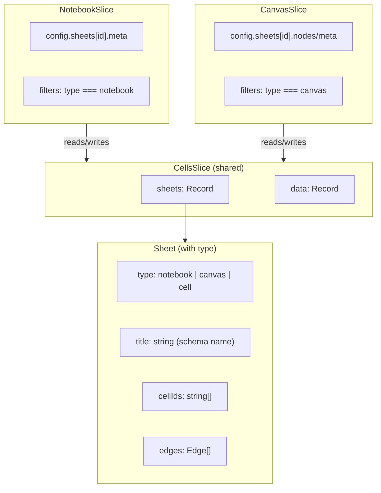

# Typed Sheets Architecture

## Current State

- Sheets in `CellsSlice` have no `type` field - all views see all sheets
- View metadata stored separately: `notebook.config.sheets[id].meta` and `canvas.config.sheets[id]`
- Tab bars show all sheets regardless of which view is active
- SQL execution creates tables in a fixed schema (`'main'` or `'canvas'`)

## Target Architecture




## Changes

### Phase 1: Add Sheet Type to CellsSlice

**File: [packages/cells/src/types.ts](packages/cells/src/types.ts)**Add `SheetType` enum and update `SheetSchema`:

```typescript
export const SheetTypeSchema = z.enum(['notebook', 'canvas', 'cell']);
export type SheetType = z.infer<typeof SheetTypeSchema>;

export const SheetSchema = z.object({
  id: z.string(),
  type: SheetTypeSchema,  // NEW
  title: z.string(),
  cellIds: z.array(z.string()).default([]),
  edges: z.array(EdgeSchema).default([]),
});
```

**File: [packages/cells/src/cellsSlice.ts](packages/cells/src/cellsSlice.ts)**

- Update `addSheet` to accept `type` parameter (default: `'notebook'`)
- Update `addCell` to set `type` when auto-creating sheets
- Add helper selectors: `getSheetsByType(type)`

### Phase 2: Update NotebookSlice to Filter by Type

**File: [packages/notebook/src/NotebookSlice.ts](packages/notebook/src/NotebookSlice.ts)**

- `addTab`: Pass `type: 'notebook'` to `cells.addSheet()`
- Add `getNotebookSheets()` selector that filters `cells.config.sheets` by `type === 'notebook'`
- Update all sheet operations to only work on notebook-type sheets

**File: [packages/notebook/src/Notebook.tsx](packages/notebook/src/Notebook.tsx)**

- Update `SheetsTabBar` to filter `sheetOrder` to only show notebook sheets
- Add UI to create new notebook sheets

### Phase 3: Update CanvasSlice to Filter by Type

**File: [packages/canvas/src/CanvasSlice.ts](packages/canvas/src/CanvasSlice.ts)**

- When adding nodes, ensure sheet is created with `type: 'canvas'`
- Add `getCanvasSheets()` selector
- Update all sheet operations to only work on canvas-type sheets

**File: [packages/canvas/src/Canvas.tsx](packages/canvas/src/Canvas.tsx)**

- Update `SheetsTabBar` to filter to canvas sheets only
- Add UI to create new canvas sheets

### Phase 4: DuckDB View Naming with User-Entered Names

**File: [packages/cells/src/execution.ts](packages/cells/src/execution.ts)**Currently uses fixed `schemaName` parameter. Update to:

1. Get sheet title from `cells.config.sheets[sheetId].title` for schema name
2. Use `cell.data.title` for view/table name
3. Create VIEWs instead of TABLEs for lazy evaluation
```typescript
// Find sheet for this cell
const sheetId = findSheetIdForCell(state, cellId);
const sheet = state.cells.config.sheets[sheetId];

const schemaName = escapeId(sheet.title);  // User-entered sheet name
const viewName = escapeId(cell.data.title); // User-entered cell name

await connector.query(`CREATE SCHEMA IF NOT EXISTS ${schemaName}`);
await connector.query(`CREATE OR REPLACE VIEW ${schemaName}.${viewName} AS ${sql}`);
```


**File: [packages/cells/src/cellsSlice.ts](packages/cells/src/cellsSlice.ts)**

- Add `findSheetIdForCell(cellId)` helper function
- Update `runCell` to pass the sheet context to execution

**Validation (new file): [packages/cells/src/validation.ts](packages/cells/src/validation.ts)**

- `validateCellTitle(title, sheetId, cells)`: Ensure unique within sheet
- `validateSheetTitle(title, sheets)`: Ensure unique across sheets
- Call validation in `renameCell` and `renameSheet`

### Phase 5: Update Examples

**File: [examples/notebook/src/store.ts](examples/notebook/src/store.ts)**

- No changes needed - notebook will auto-create sheets with `type: 'notebook'`

**File: [examples/canvas/src/store.ts](examples/canvas/src/store.ts)**

- No changes needed - canvas will auto-create sheets with `type: 'canvas'`

## Migration Notes

- Existing persisted data without `type` field will need a migration
- Default `type` to `'notebook'` for backwards compatibility
- Add migration in persistence layer to add `type` field to existing sheets

## Files to Modify