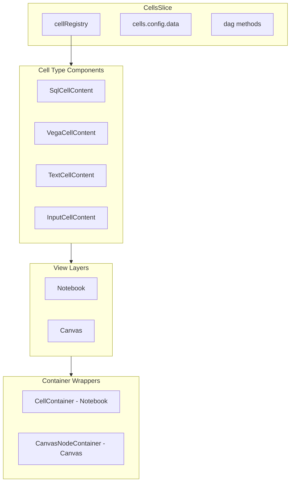

# Unified Cell Architecture

## Goals

- Unify Notebook cells and Canvas nodes as "cells" with shared content components
- Move `cellRegistry` from `NotebookSlice` to `CellsSlice` as an initialization prop
- Export `createDefaultCellRegistry()` from `@sqlrooms/cells`
- Make `CellsSlice` type-agnostic (no hardcoded cell types)
- Merge `@sqlrooms/dag` logic into `cellsSlice` (eliminate separate module)

## Architecture




## Key Changes

### 1. Cell Registry Interface

Define a new `CellRegistryItem` type in [`packages/cells/src/types.ts`](packages/cells/src/types.ts):

```typescript
export type CellContainerProps = {
  header?: React.ReactNode;
  content: React.ReactNode;
  footer?: React.ReactNode;
};

export type CellRegistryItem<TCell = Cell> = {
  type: string;
  title: string;
  createCell: (id: string) => TCell;
  renderCell: (props: {
    id: string;
    cell: TCell;
    renderContainer: (props: CellContainerProps) => React.ReactElement;
  }) => React.ReactElement;
  // Find dependencies for DAG - each cell type defines its own logic
  findDependencies: (args: {
    cell: TCell;
    cells: Record<string, Cell>;
    sheetId: string;
  }) => string[];
  // Optional: custom execution logic (defaults to SQL execution for sql type)
  runCell?: (args: {id: string; opts?: {cascade?: boolean}}) => Promise<void>;
};

export type CellRegistry = Record<string, CellRegistryItem>;
```

**Dependency Examples:**

- **SQL cells**: Parse SQL to find references to other cell titles (e.g., `FROM Query_1`)
- **Vega cells**: Return `[sqlId]` if linked to another cell
- **Text/Input cells**: Return `[]` (no dependencies)

### 2. Update CellsSlice

Modify [`packages/cells/src/cellsSlice.ts`](packages/cells/src/cellsSlice.ts):

- Accept `cellRegistry` as initialization prop
- Inline the DAG logic (currently in `dagSlice.ts`) directly
- Remove hardcoded cell type checks (e.g., `if (cell.type === 'sql')`)
- Delegate `findDependencies` to registry item for each cell type
- Delegate execution to registry's `runCell` if provided
```typescript
export function createCellsSlice(props: {
  cellRegistry: CellRegistry;
}) {
  // cellRegistry stored in state
  // DAG uses: registry[cell.type].findDependencies({cell, cells, sheetId})
  // Execution uses: registry[cell.type].runCell?.({id, opts})
}
```


### 3. Create Default Cell Registry

Add [`packages/cells/src/defaultCellRegistry.tsx`](packages/cells/src/defaultCellRegistry.tsx):

- Export `createDefaultCellRegistry()` returning registry for: sql, text, vega, input
- Each entry uses new content components

### 4. Unified Cell Content Components

Move/refactor cell content components to [`packages/cells/src/components/`](packages/cells/src/components/):

- `SqlCellContent.tsx` - SQL editor + run button + results (already partially exists as `SqlCellBody`)
- `VegaCellContent.tsx` - Chart rendering + config
- `TextCellContent.tsx` - Markdown editor/viewer
- `InputCellContent.tsx` - Input controls

Each component receives `renderContainer` and calls it with `{header, content, footer}`.

### 5. Update Notebook View

Modify [`packages/notebook/src/Notebook.tsx`](packages/notebook/src/Notebook.tsx):

- Remove `cellRegistry` from `NotebookSliceState`
- Get registry from `cells.cellRegistry`
- Pass a `renderContainer` that wraps with `CellContainer`
```typescript
const renderContainer = ({header, content, footer}: CellContainerProps) => (
  <CellContainer id={id} header={header} footer={footer}>
    {content}
  </CellContainer>
);
```


### 6. Update Canvas View

Modify [`packages/canvas/src/Canvas.tsx`](packages/canvas/src/Canvas.tsx):

- Use same registry from `cells.cellRegistry`
- Pass a `renderContainer` that wraps with `CanvasNodeContainer`
- Remove hardcoded `nodeTypes` mapping

### 7. Merge DAG into CellsSlice

- Copy DAG logic from [`packages/cells/src/dagSlice.ts`](packages/cells/src/dagSlice.ts) directly into `cellsSlice.ts`
- Remove `createDagSlice` export
- Keep `dag` property on state for API compatibility
- Delete [`packages/dag`](packages/dag) module
- Use `cellRegistry[cell.type].findDependencies()` to build the dependency graph (no more hardcoded logic)

### 8. Update Exports

Update [`packages/cells/src/index.ts`](packages/cells/src/index.ts):

```typescript
export {createCellsSlice} from './cellsSlice';
export {createDefaultCellRegistry} from './defaultCellRegistry';
export type {CellRegistry, CellRegistryItem, CellContainerProps} from './types';
// Remove: export {createDagSlice} ...
```


## Files to Modify

| File | Change ||------|--------|| `packages/cells/src/types.ts` | Add CellRegistry types || `packages/cells/src/cellsSlice.ts` | Accept registry prop, inline DAG || `packages/cells/src/defaultCellRegistry.tsx` | New file with default registry || `packages/cells/src/components/SqlCellContent.tsx` | Refactor from SqlCellBody || `packages/cells/src/components/VegaCellContent.tsx` | New unified component || `packages/cells/src/components/TextCellContent.tsx` | New unified component || `packages/cells/src/components/InputCellContent.tsx` | New unified component || `packages/cells/src/index.ts` | Update exports || `packages/notebook/src/NotebookSlice.ts` | Remove cellRegistry || `packages/notebook/src/Notebook.tsx` | Use cells.cellRegistry || `packages/notebook/src/cells/CellView.tsx` | Use renderContainer pattern || `packages/canvas/src/Canvas.tsx` | Use cells.cellRegistry || `packages/canvas/src/CanvasSlice.ts` | Remove hardcoded node types || `examples/notebook/src/store.ts` | Pass registry to createCellsSlice || `packages/dag/*` | Delete entire module |

## Migration Notes