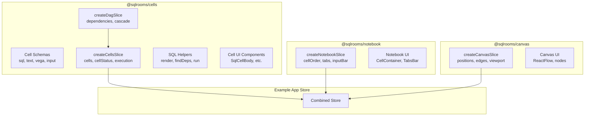

# Unified Cells Architecture

## Architecture Overview

```mermaid
flowchart TB
    subgraph cells_pkg ["@sqlrooms/cells"]
        CellSchemas["Cell Schemas<br/>sql, text, vega, input"]
        CellsSlice["createCellsSlice<br/>cells, cellStatus, execution"]
        DagSlice["createDagSlice<br/>dependencies, cascade"]
        SqlHelpers["SQL Helpers<br/>render, findDeps, run"]
        CellUI["Cell UI Components<br/>SqlCellBody, etc."]
    end

    subgraph notebook_pkg ["@sqlrooms/notebook"]
        NotebookSlice["createNotebookSlice<br/>cellOrder, tabs, inputBar"]
        NotebookUI["Notebook UI<br/>CellContainer, TabsBar"]
    end

    subgraph canvas_pkg ["@sqlrooms/canvas"]
        CanvasSlice["createCanvasSlice<br/>positions, edges, viewport"]
        CanvasUI["Canvas UI<br/>ReactFlow, nodes"]
    end

    subgraph app ["Example App Store"]
        Store["Combined Store"]
    end

    CellsSlice --> Store
    NotebookSlice --> Store
    CanvasSlice --> Store
    DagSlice --> CellsSlice


```