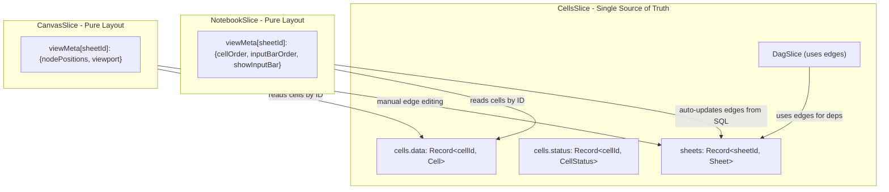

# Unified Sheets Architecture

## Current Problem

Both `NotebookSlice` and `CanvasSlice` store cells in their own `config.dags[dagId].cells`, violating the single source of truth (`cells.data`). Cross-view syncing code (lines 240-255 in NotebookSlice, 373-386 in CanvasSlice) creates duplicate data and synchronization bugs.

## Target Architecture




## Key Changes

### 1. Expand CellsSlice to Own Sheets and Edges

In [`packages/cells/src/types.ts`](packages/cells/src/types.ts), add:

```typescript
export type Sheet = {
  id: string;
  title: string;
  cellIds: string[];      // Which cells belong to this sheet
  edges: Edge[];          // Dependencies (source -> target)
};

export type Edge = {
  id: string;
  source: string;  // cellId
  target: string;  // cellId
};

export type CellsSliceState = {
  cells: {
    data: Record<string, Cell>;
    status: Record<string, CellStatus>;
    activeAbortControllers: Record<string, AbortController>;
    
    // Sheet management
    sheets: Record<string, Sheet>;
    sheetOrder: string[];
    currentSheetId?: string;
    
    // Cell CRUD
    addCell: (sheetId: string, cell: Cell, index?: number) => void;
    removeCell: (cellId: string) => void;
    updateCell: (id: string, updater: (cell: Cell) => Cell) => void;
    
    // Sheet CRUD
    addSheet: (title?: string) => string;
    removeSheet: (sheetId: string) => void;
    renameSheet: (sheetId: string, title: string) => void;
    setCurrentSheet: (sheetId: string) => void;
    
    // Edge management
    addEdge: (sheetId: string, edge: Omit<Edge, 'id'>) => void;
    removeEdge: (sheetId: string, edgeId: string) => void;
    updateEdgesFromSql: (sheetId: string, cellId: string) => void;
    
    // Execution
    runCell: (id: string, opts?: {cascade?: boolean; schemaName?: string}) => Promise<void>;
    cancelCell: (id: string) => void;
  };
};
```


### 2. Move DagSlice into CellsSlice

In [`packages/cells/src/cellsSlice.ts`](packages/cells/src/cellsSlice.ts):

- Create DagSlice internally with `getDagConfig` pointing to `cells.sheets`
- Use edges for dependency resolution (not SQL parsing at runtime)
- Export combined slice
```typescript
export function createCellsSlice() {
  return createSlice<CellsSliceState & DagSliceState, CellsRootState>((set, get, store) => {
    const dagSlice = createDagSlice({
      getDagConfig: (state) => ({
        dags: Object.fromEntries(
          Object.entries(state.cells.sheets).map(([id, sheet]) => [
            id,
            {
              id,
              cells: Object.fromEntries(
                sheet.cellIds.map(cid => [cid, state.cells.data[cid]])
              ),
              meta: { edges: sheet.edges },
            },
          ])
        ),
        dagOrder: state.cells.sheetOrder,
        currentDagId: state.cells.currentSheetId,
      }),
      findDependencies: ({ cell, dagId, getState }) => {
        const sheet = getState().cells.sheets[dagId];
        return sheet?.edges
          .filter(e => e.target === cell.id)
          .map(e => e.source) ?? [];
      },
      runCell: async ({ cellId, cascade, getState }) => {
        await getState().cells.runCell(cellId, { cascade });
      },
    })(set, get, store);
    
    return { ...dagSlice, cells: { /* ... */ } };
  });
}
```


### 3. Simplify NotebookSlice to Pure Layout

In [`packages/notebook/src/NotebookSlice.ts`](packages/notebook/src/NotebookSlice.ts):

- Remove `createDagSlice` call
- Remove cell storage (`config.dags[id].cells`)
- Remove `cellStatus`, `activeAbortControllers`
- Keep only view-specific metadata
```typescript
export type NotebookViewMeta = {
  cellOrder: string[];      // Display order (subset/reorder of sheet.cellIds)
  inputBarOrder: string[];  // Which inputs show in bar
  showInputBar: boolean;
};

export type NotebookSliceState = {
  notebook: {
    viewMeta: Record<string, NotebookViewMeta>;  // keyed by sheetId
    cellRegistry: CellRegistry;
    
    // View-specific actions (delegate cell ops to cells.*)
    addCell: (sheetId: string, type: CellType, index?: number) => string;
    moveCell: (sheetId: string, cellId: string, direction: 'up' | 'down') => void;
    toggleShowInputBar: (sheetId: string) => void;
  };
};
```


Key: `notebook.addCell` calls `cells.addCell` internally and also updates `viewMeta.cellOrder`.

### 4. Simplify CanvasSlice to Pure Layout

In [`packages/canvas/src/CanvasSlice.ts`](packages/canvas/src/CanvasSlice.ts):

- Remove `createDagSlice` call
- Remove cell storage (`config.dags[id].cells`)
- Remove `sqlResults` (use `cells.status` instead)
- Keep only layout metadata
```typescript
export type CanvasNodePosition = {
  x: number;
  y: number;
  width: number;
  height: number;
};

export type CanvasViewMeta = {
  nodePositions: Record<string, CanvasNodePosition>;  // keyed by cellId
  viewport: { x: number; y: number; zoom: number };
};

export type CanvasSliceState = {
  canvas: {
    viewMeta: Record<string, CanvasViewMeta>;  // keyed by sheetId
    isAssistantOpen: boolean;
    
    // Layout actions
    addNode: (params: { sheetId: string; cellType: CellType; position?: XYPosition }) => string;
    updateNodePosition: (cellId: string, position: Partial<CanvasNodePosition>) => void;
    setViewport: (sheetId: string, viewport: Viewport) => void;
    
    // Edge actions delegate to cells.addEdge / cells.removeEdge
  };
};
```


### 5. Auto-Update Edges from SQL

Add a helper in [`packages/cells/src/sqlHelpers.ts`](packages/cells/src/sqlHelpers.ts):

```typescript
export function deriveEdgesFromSql(
  cellId: string,
  sql: string,
  allCells: Record<string, Cell>,
  existingEdges: Edge[],
): Edge[] {
  // Parse SQL for {{varName}} references and table names
  // Match against input cells (varName) and sql cells (title as table name)
  // Return edges where source = dependency, target = cellId
}
```

Call this in `cells.updateCell` when a SQL cell's content changes.

### 6. Update Example App

In [`examples/notebook/src/store.ts`](examples/notebook/src/store.ts):

```typescript
export const {roomStore, useRoomStore} = createRoomStore<RoomState>(
  persist(
    (set, get, store) => ({
      ...createRoomShellSlice({ /* ... */ })(set, get, store),
      
      // CellsSlice now includes DagSlice
      ...createCellsSlice()(set, get, store),
      
      // These are now pure layout adapters
      ...createNotebookSlice()(set, get, store),
      ...createCanvasSlice({ ai: { /* ... */ } })(set, get, store),
    }),
    // ...
  ),
);
```


## Files to Modify

| File | Changes |

|------|---------|

| `packages/cells/src/types.ts` | Add Sheet, Edge types; expand CellsSliceState |

| `packages/cells/src/cellsSlice.ts` | Add sheets, edges, DagSlice; sheet CRUD |

| `packages/cells/src/sqlHelpers.ts` | Add deriveEdgesFromSql helper |

| `packages/cells/src/index.ts` | Export new types |

| `packages/notebook/src/NotebookSlice.ts` | Remove DagSlice, cell storage; keep viewMeta only |

| `packages/notebook/src/cellSchemas.ts` | Simplify to reference CellsSlice types |

| `packages/notebook/src/NotebookStateTypes.ts` | Update state types |

| `packages/notebook/src/cells/*.tsx` | Update to read from cells.data/cells.status |

| `packages/canvas/src/CanvasSlice.ts` | Remove DagSlice, cell storage; keep viewMeta only |

| `packages/canvas/src/Canvas.tsx` | Read cells from cells.data |

| `packages/canvas/src/nodes/*.tsx` | Read from cells.data/cells.status |

| `examples/notebook/src/store.ts` | Update slice composition |

## Migration Notes

- Rename "tabs" (Notebook) and "dags" (Canvas) to "sheets" uniformly
- Edges become the single dependency mechanism for both views
- Notebook auto-derives edges when SQL changes
- Canvas allows manual edge manipulation